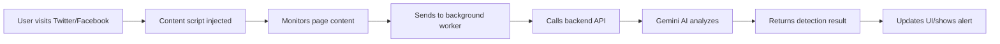

# HerCircle Shield Chrome Extension

## Overview

The HerCircle Shield Chrome extension provides real-time protection against gender-based violence (GBV) and online harassment on social media platforms.

## Features

- 🛡️ **Real-time Content Detection** - AI-powered detection of harmful content
- 🚨 **Panic Button** - Emergency alert system
- 📸 **Evidence Capture** - Screenshot harmful content
- 👥 **Trusted Contacts** - Emergency contact management
- 📊 **Safety Statistics** - Track threats detected and blocked
- 🌍 **Regional Hotlines** - Quick access to GBV support services

## Supported Platforms

- Twitter/X
- Facebook
- Instagram
- LinkedIn
- TikTok
- WhatsApp Web
- Gmail

## Installation

### Development Mode

1. **Start the Backend Server**
   ```bash
   cd /path/to/hercircle-shield
   pnpm dev
   ```
   The server should be running on `http://localhost:3000`

2. **Load Extension in Chrome**
   - Open Chrome and navigate to `chrome://extensions/`
   - Enable **Developer mode** (toggle in top-right)
   - Click **"Load unpacked"**
   - Select the `extension` folder from this project
   - The extension icon (💗) should appear in your toolbar

3. **Verify Installation**
   - Click the extension icon
   - You should see the HerCircle Shield popup
   - Check browser console for any errors

### Production Deployment

1. **Update API URL**
   
   Edit `extension/background/service-worker.js`:
   ```javascript
   // Change this to your production backend URL
   const API_BASE_URL = 'https://your-backend-domain.com/api/trpc';
   ```

2. **Build Extension**
   ```bash
   # No build step needed - extension uses vanilla JS
   # Just zip the extension folder for Chrome Web Store
   cd extension
   zip -r ../hercircle-shield-extension.zip .
   ```

3. **Publish to Chrome Web Store**
   - Go to [Chrome Web Store Developer Dashboard](https://chrome.google.com/webstore/devconsole)
   - Upload `hercircle-shield-extension.zip`
   - Fill in store listing details
   - Submit for review

## Configuration

### Backend API Connection

The extension connects to your backend server for AI detection. Update the API URL in:

**File:** `extension/background/service-worker.js`

```javascript
// Development (default)
const API_BASE_URL = 'http://localhost:3000/api/trpc';

// Production
const API_BASE_URL = 'https://your-backend.com/api/trpc';
```

### API Endpoints Used

| Endpoint | Method | Purpose |
|----------|--------|---------|
| `/api/trpc/ai.detect` | POST | Content detection with Gemini AI |

**Request Format (tRPC):**
```json
{
  "input": {
    "content": "text to analyze"
  }
}
```

**Response Format:**
```json
{
  "result": {
    "data": {
      "isHarmful": true,
      "detectionType": ["harassment", "threats"],
      "severity": "high",
      "confidence": 95,
      "explanation": "Content contains threats",
      "aiModel": "gemini-2.0-flash-exp"
    }
  }
}
```

## Extension Architecture

```
extension/
├── manifest.json              # Extension configuration
├── icons/                     # Extension icons
│   ├── heart-16.png
│   ├── heart-32.png
│   ├── heart-48.png
│   └── heart-128.png
├── popup/                     # Extension popup UI
│   ├── popup.html            # Main UI
│   ├── popup.css             # Styling
│   └── popup.js              # UI logic
├── content/                   # Content scripts (injected into pages)
│   ├── content.js            # Detection logic
│   └── styles.css            # Content styles
├── background/                # Background service worker
│   └── service-worker.js     # Background tasks, API calls
└── lib/                       # Offline detection
    └── offline-detection.js  # Keyword-based fallback
```

## How It Works

### 1. Content Detection Flow



### 2. Offline Fallback

If the backend is unavailable, the extension uses offline keyword-based detection:

**File:** `extension/lib/offline-detection.js`

- Keyword matching for common threats
- Lower confidence scores
- Basic severity classification
- No AI model required

### 3. Data Storage

All data is stored locally in Chrome storage:

```javascript
chrome.storage.local.set({
  detectionCount: 0,
  blockedCount: 0,
  evidenceList: [],
  trustedContacts: [],
  settings: {
    sensitivity: 'balanced',
    autoHide: true,
    enableNotifications: true
  }
});
```

## Testing

### Test AI Detection

1. Load the extension
2. Navigate to Twitter or Facebook
3. Open browser console (F12)
4. The extension should log: `"HerCircle Shield content script loaded"`
5. Post or view content with test phrases
6. Check extension popup for detection stats

### Test Offline Mode

1. Stop the backend server (`pnpm dev`)
2. Navigate to a social media site
3. The extension should fall back to offline detection
4. Check console for: `"Falling back to offline detection"`

### Test Panic Button

1. Open extension popup
2. Click **🚨 Panic Button**
3. Confirm the alert
4. Check that notification appears
5. Verify trusted contacts would be alerted (if configured)

## Troubleshooting

### Extension Not Loading

- Check `chrome://extensions/` for errors
- Verify you selected the `extension` folder (not parent)
- Click "Reload" button on the extension card

### API Connection Failed

**Error:** `API request failed: 404`

**Solution:**
- Verify backend is running: `pnpm dev`
- Check API_BASE_URL in `service-worker.js`
- Ensure URL is `http://localhost:3000/api/trpc`

**Error:** `CORS policy blocked`

**Solution:**
- Backend should allow `chrome-extension://` origins
- Check `server/_core/index.ts` for CORS configuration

### No Detections Showing

- Check browser console for errors
- Verify backend has `GEMINI_API_KEY` configured
- Test API directly:
  ```bash
  curl -X POST http://localhost:3000/api/trpc/ai.detect \
    -H "Content-Type: application/json" \
    -d '{"input":{"content":"test harmful content"}}'
  ```

### Icon Not Showing

- Click puzzle piece icon (🧩) in Chrome toolbar
- Pin "HerCircle Shield" to toolbar
- Refresh the page

## Development

### Making Changes

1. **Edit Extension Files**
   ```bash
   # Edit any file in extension/ folder
   vim extension/popup/popup.js
   ```

2. **Reload Extension**
   - Go to `chrome://extensions/`
   - Click "Reload" button on HerCircle Shield card
   - Refresh any open tabs

3. **View Logs**
   - **Popup logs:** Right-click extension icon → "Inspect popup"
   - **Background logs:** `chrome://extensions/` → "Inspect views: service worker"
   - **Content script logs:** F12 on any webpage

### Adding New Features

1. **Add UI to Popup**
   - Edit `extension/popup/popup.html`
   - Add styles in `extension/popup/popup.css`
   - Add logic in `extension/popup/popup.js`

2. **Add Background Task**
   - Edit `extension/background/service-worker.js`
   - Add message handler in `chrome.runtime.onMessage`

3. **Add Content Script Feature**
   - Edit `extension/content/content.js`
   - Inject into pages via `manifest.json`

## Security & Privacy

### Data Collection

- ✅ **Local Storage Only** - All data stored in Chrome local storage
- ✅ **No Cloud Sync** - Data never leaves user's device (unless backend is called)
- ✅ **Anonymous IDs** - Generated locally, not linked to identity
- ✅ **User Control** - Export/delete data anytime

### Permissions

The extension requests:

- `storage` - Save settings and evidence locally
- `notifications` - Alert user to threats
- `activeTab` - Monitor current page
- `tabs` - Track which platforms user is on
- `scripting` - Inject content detection scripts
- `alarms` - Schedule background tasks
- `geolocation` - GPS for panic button (optional)

### API Communication

- Backend API calls are made over HTTPS in production
- No personal data sent to backend (only content text)
- API key (GEMINI_API_KEY) stored on backend, not in extension

## Support

For issues or questions:
- GitHub Issues: https://github.com/Mutindadev/hercircle-shield/issues
- Email: support@hercircle.com

## License

MIT License - See LICENSE file for details
